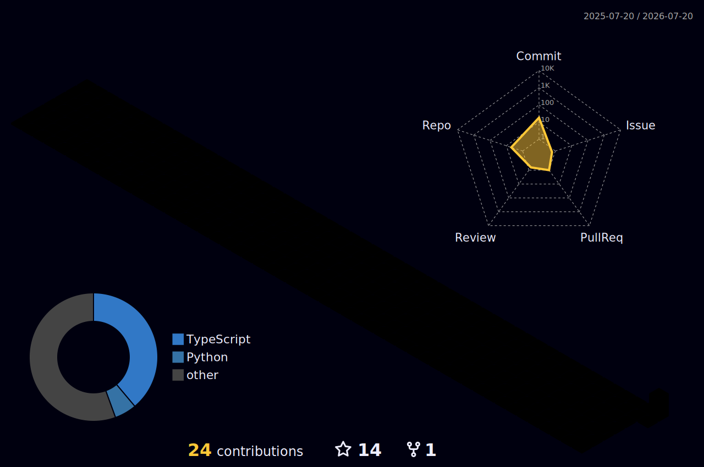

<!-- Typing SVG 打字动画（替代原敲代码动图，对齐博客 hero 紫青渐变） -->

<!-- for beauty 留个空行好看点 -->

&nbsp;

<!-- profile logo 个人资料徽标：博客 + 访问量 -->

  &emsp;
  &emsp;
  

<!-- Snake Code Contribution Map 贪吃蛇代码贡献图（由 snake.yaml 定时生成，推到 output 分支） -->
<picture>
  <source media="(prefers-color-scheme: dark)" srcset="https://raw.githubusercontent.com/Quashy/Quashy/output/github-contribution-grid-snake-dark.svg">
  <source media="(prefers-color-scheme: light)" srcset="https://raw.githubusercontent.com/Quashy/Quashy/output/github-contribution-grid-snake.svg">
  
</picture>

## 🙋 About Me

<table>
<tr><td>

&emsp;&emsp;嗨，我是秦晖洋（Quashy），一名 Java 后端开发。白天写服务端，夜里折腾各种好玩的东西。

&emsp;&emsp;做过双拼练习网站「<a href="https://github.com/Quashy/bingji-shuangpin">并击</a>」，用 VitePress 搭了<a href="https://quashy.github.io/">个人博客</a>，记录技术实践、开源贡献与 AI 时代的思考。相信开源与分享让世界更好。

&emsp;&emsp;最近在探索：用 LLM 做人生设计、把国产模型接进自己的工具链、让中文输入更顺手。

&emsp;&emsp;<strong>We're making the world a better place. Through constructing elegant hierarchies for maximum code reuse and extensibility.</strong>

&nbsp;

</td></tr>
</table>

## 📝 Featured Projects

<table>
  <tr>
    <td width="50%" valign="top">
      <h3 align="center">OpenClaw4J</h3>
      

    </td>
    <td width="50%" valign="top">
      <h3 align="center">并击 · 双拼练习</h3>
      

    </td>
  </tr>
  <tr>
    <td width="50%" valign="top">
      <h3 align="center">Quashy.github.io</h3>
      

    </td>
    <td width="50%" valign="top">
      <h3 align="center">shikan-reader · 鹿鸣阅读器</h3>
      

    </td>
  </tr>
</table>

## 🛠 Tech Stack

<!-- 从实际项目语言足迹提炼：Java 主业 + TS/CSS/PS/Python 折腾 + 工具链 -->

  
  
  
  
  
  

  
  
  
  
  
  

## 📊 GitHub Stats

<!-- 统计卡 + 语言占比 + 连续贡献，紫青渐变配色对齐博客 hero -->

  
  

<picture>
  <source media="(prefers-color-scheme: light)" srcset="https://streak-stats.demolab.com/?user=Quashy&theme=light&hide_border=true&ring=bd34fe&fire=41d1ff&currStreakLabel=c9d1d9" />
  
</picture>

<!-- GitHub Activity Graph 活动曲线图 -->
<table>
  <tr>
    <td>
      <picture>
        <source media="(prefers-color-scheme: dark)" srcset="https://github-readme-activity-graph.vercel.app/graph?username=Quashy&theme=tokyo-night&color=bd34fe&line=41d1ff&point=bd34fe" />
        <source media="(prefers-color-scheme: light)" srcset="https://github-readme-activity-graph.vercel.app/graph?username=Quashy&theme=xcode&color=bd34fe&line=41d1ff&point=bd34fe" />
        
      </picture>
    </td>
  </tr>
</table>

<!-- profile-3d-contrib 3D 贡献图（由 profile-3d.yml 每日生成并提交到主分支） -->
<picture>
  <source media="(prefers-color-scheme: dark)" srcset="profile-3d-contrib/profile-night-rainbow.svg" />
  <source media="(prefers-color-scheme: light)" srcset="profile-3d-contrib/profile-gitblock.svg" />
  
</picture>

## 🎵 Now Playing

<!-- Spotify 轻量方案：部署后替换为你的 Vercel 域名 + UID，占位先显示静态图 -->

  

> 🚧 Spotify 后端待部署（轻量方案，无需 Firebase），部署后替换上方 URL 的 `uid=todo` 为你的 Spotify UID。

## 💬 Dev Quote

  

## 📕 Latest Blog Posts

<!-- blog-post-workflow 占位：博客 RSS 接入后由 Actions 自动填充 -->
<!-- BLOG-POST-LIST:START -->
- 📝 [从全拼到双拼：我为什么做了「并击」](https://quashy.github.io/2026/from-quanpin-to-shuangpin) — 2026-07-19
- 📝 [如何参与开源项目](https://quashy.github.io/2026/how-to-contribute-to-open-source) — 2026-07-16
- 📝 [人生设计：探索你的现在](https://quashy.github.io/2026/designing-your-life) — 2026-07-14
- 📝 [OpenCode GO 接入 CC Switch 指南](https://quashy.github.io/2026/opencode-go-ccw) — 2026-06-30
<!-- BLOG-POST-LIST:END -->

> RSS 同步待接入：博客加 `vitepress-plugin-rss` 产出 `/rss.xml` 后，配置 `blog-post-workflow` 自动更新此区块。

---

<!-- 社交链接 -->
&emsp;
&emsp;

