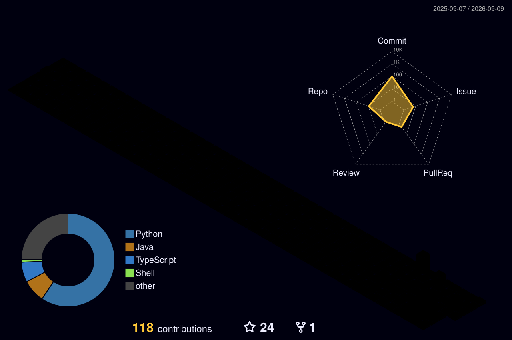

# Hi，我是秦晖洋（Quashy）👋

> 软件应用开发者，关注 AI Agent、开发者工具与个人效率软件。

主要使用 Java、Spring Boot 构建后端应用，也使用 TypeScript、React 开发 Web 与桌面应用。近期围绕 Spring AI、MCP、Agent 工具调用和本地记忆进行工程实践。

目前关注软件应用开发，以及 Java 后端和 Java + AI 应用方向的工作机会。

## 🧭 核心能力

- **软件应用开发**：从实际需求出发完成产品设计、技术实现、验证与交付。
- **Java 后端与 Agent 实践**：使用 Java、Spring Boot、Spring AI 实践 Agent 编排、工具系统、MCP 接入和本地记忆。
- **TypeScript 应用开发**：使用 TypeScript、React、Next.js 和 Electron 构建 Web 与桌面应用。
- **工程质量与技术表达**：重视类型检查、自动化测试、构建验证和技术文档，并通过博客持续记录实践过程。

## 🔭 正在开发

### 拾刊 · 本地优先 RSS 阅读器

一款面向 Windows 10/11 的本地优先 Electron RSS 阅读器，希望把订阅的作者与内容整理成更接近“刊物”的阅读体验。目前处于 MVP 开发阶段，尚未公开仓库。

`TypeScript` · `Electron` · `React` · `SQLite` · `Vite`

## 🛠️ 代表项目

### [OpenClaw4J](https://github.com/Quashy/OpenClaw4J)

一个基于 Java、Spring Boot 和 Spring AI 实现的本地优先 Agent 内核，用于实践 Agent 执行循环、工具调用、MCP 接入、本地记忆和工具安全治理。

- **技术栈：** Java、Spring Boot、Spring AI、SQLite、MCP
- **主要工作：** 核心架构、Agent 编排、工具系统、记忆机制与渠道接入
- **项目特点：** 文件驱动、本地优先、Skill 与 Tool 分离、服务端安全治理

[查看源码](https://github.com/Quashy/OpenClaw4J) · [阅读项目说明](https://github.com/Quashy/OpenClaw4J#readme)

### [并击 · 双拼打字练习](https://github.com/Quashy/bingji-shuangpin)

一款面向全拼用户的双拼学习与提速工具，从键位学习逐步过渡到词组和真实文章训练。

- **技术栈：** Next.js、React、TypeScript
- **主要工作：** 产品设计、交互实现、训练逻辑与线上部署
- **项目特点：** 支持多套双拼方案、错题复习、本地训练记录和离线内容回退

[在线体验](https://quashy.github.io/bingji-shuangpin/) · [查看源码](https://github.com/Quashy/bingji-shuangpin) · [设计思路](https://quashy.github.io/2026/from-quanpin-to-shuangpin.html)

## 📕 技术写作

<!-- 博客 RSS 由 blog-post-workflow 自动同步，保留最近 99 篇 -->
<!-- BLOG-POST-LIST:START -->
- 📝 `2026-08-21` — [从流程图到状态机：我怎样落地一个审批需求](https://quashy.github.io/2026/lightweight-approval-workflow.html)
- 📝 `2026-08-18` — [一次登录，到底发生了什么：从 Session 到 SSO、OAuth 2.0、OIDC 与 SAML](https://quashy.github.io/2026/understanding-sso-auth-protocols.html)
- 📝 `2026-07-19` — [从全拼到双拼：我为什么做了「并击」](https://quashy.github.io/2026/from-quanpin-to-shuangpin.html)
- 📝 `2026-07-16` — [如何参与开源项目](https://quashy.github.io/2026/how-to-contribute-to-open-source.html)
- 📝 `2026-07-14` — [人生设计：探索你的现在](https://quashy.github.io/2026/designing-your-life.html)
- 📝 `2026-06-30` — [OpenCode GO 接入 CC Switch 指南](https://quashy.github.io/2026/opencode-go-ccw.html)<!-- BLOG-POST-LIST:END -->

更多内容可以在[个人博客](https://quashy.github.io/)中查看或通过 [RSS](https://quashy.github.io/feed.xml) 订阅。

## 🙋 关于我

我是一名喜欢把想法做成可运行应用的软件开发者。工作之外，我会用 Java 探索 Agent 的工程实现，用 TypeScript 构建自己想用的产品，并通过博客记录技术实践、开源经历与设计思考。

我相信持续构建、验证和分享，是理解技术最有效的方式。

## 📊 GitHub Stats

  
  &emsp;
  

<picture>
  <source media="(prefers-color-scheme: dark)" srcset="profile-3d-contrib/profile-night-rainbow.svg" />
  <source media="(prefers-color-scheme: light)" srcset="profile-3d-contrib/profile-gitblock.svg" />
  
</picture>

🎵 最近在听

  

---

&emsp;
&emsp;
&emsp;

  

**We're making the world a better place. Through constructing elegant hierarchies for maximum code reuse and extensibility.**

